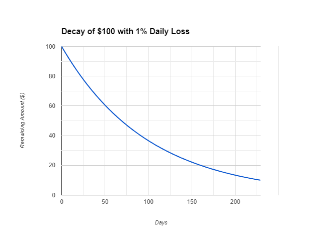
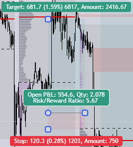
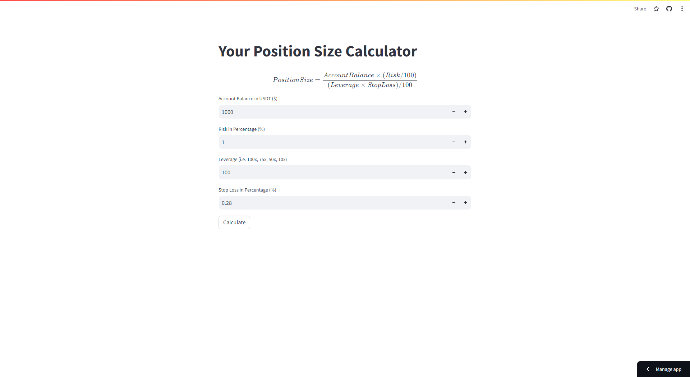

# 📱What is a Position Size Calculator?
A position size calculator is used by traders to precisely calculate their position size for every trade.   

Precisely calculating position size for every trade is crucial for a trader's portfolio as it allows them to manage their risk on a trade.  

I developed this Position Size Calculator specifically for Futures Contracts Cryptocurrency Trading. As I have seen some calculators being limited to only three variables (Leverage not considered into account).    

This Position Size calculator allows Traders to input all four (Account Balance, Risk, Leverage, and Stop Loss) variables to precisely calculate the position size with the added bonus of a formula on top.  

Fun Fact: It would take around 230 consecutive loses for a trader to lose 90% of $100.  

  

Note: Another feature might be added in where the client could input the entry price and the exit price.    

# 🤔How to Use the Position Size Calculator?
1. Go to this link -> https://trading-size-calculator.streamlit.app/  

2. Get Stop Loss Percentage (%) by placing the long/short position tool on the chart on any charting app of choice. In this case we have 0.28% as our Stop Loss Percentage.    

 

3. Provide input on Account Balance, Risk, Leverage, and Stop Loss. In this case, we have values of 1000, 1, 100, and 0.28. Then press the calculate button. 

  

4. Trade Responsibly!  
